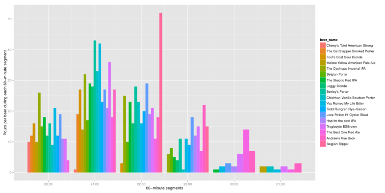

Beep!  
====================================

For the last BrewLab party, we put a few fancy electronic touches on serving.
If you were there, you probably noticed a little electronic tag on the bottom
of your tasting glass and some matte black readers hooked up to the bar taps:

With these in place, we tallied up all the beers poured.  But then what?

What did people drink?  How much?
=================================

[Larger figure (PDF) of beers by pour](./pdfs/gg.beers.by.pour.pdf)

Top three beers of the night by popular demand?  Bexley's Porter,
Love Potion #4 Oyster Stout, and You Ruined My Life Bitter.

We collectively drank about 80 gallons of beer.  With just under 1200 pours,
that's about 8oz per pour.  People had between 4 and 5 drinks on average:

[Larger figure (PDF) of drinks per person](./pdfs/qplot.drinks.hist.pdf)

Just how many beers did we pour?  When was the beer flowing?
============================================================

All told, we recorded 1,163 pours.  Beer was flowing most freely between 9pm
and 10pm, with 437 poured that hour:

[Larger figure (PDF) of overall pour rate](./pdfs/gg.overall.lines.30.pdf)

How did things change over the course of the night?
===================================================

What poured early? Late? Did drinking tastes change? What kicked the fastest?

This chart is a little unusual, but it show how the pours were more diverse
earlier in the evening compared to later.  That's probably not due to drinking
tastes, but just because of us starting to finish off kegs around 11 to 12.
Here are the breakdowns of pours, split out by hour:

[Larger figure (PDF) of diversity by hour](./pdfs/gg.bars.60.pdf)

[Splitting it out into 10-minute windows the chart is much busier](./pdfs/gg.bars.10.pdf),
but clearly shows the selection tapering off at the end.

It's also interesting to look at the pour rate over the night, by beer:

It's easier to make careful comparisons when they're stacked vertically on the
[larger figure (PDF) of pour rate over time by beer in 60 minute](./pdfs/gg.lines.60.pdf),
[30 minute](./pdfs/gg.lines.30.pdf), and [10 minute](./pdfs/gg.lines.10.pdf) windows.

Another one of the same?
========================

Did people ever go back for seconds of the same beer?  Thirds?  Fourths?

Why, yes, indeed!  The top personal favorite beers were:

1. *Belgian Trippel*: One afficionado went back 5 times.
2. *Troglodyte Brown ESB*: Someone went back 4 times and a couple of folks went back 3 times.
3. *The Skeptic Red IPA*: Someone went back 4 times for the Red IPA, too.

Andrew's Rye Bock, Love Potion #4, Cyclhops, and the Best One Red Ale were
personal-fave runners-up, each with a few people going back not just for
seconds, but thirds.
